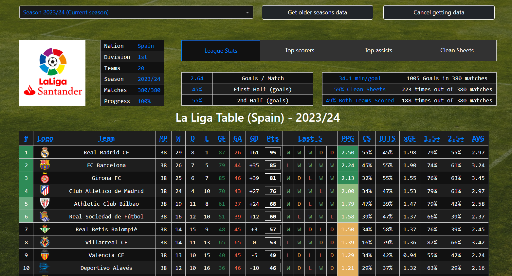

# LaLigaDashboard
Dash app to monitor the current results in the Spanish football league (Primera División - known like La Liga).

Available [_here_](https://laligadashboard.onrender.com) - demo version.


## Table of Contents
* [General Info](#general-information)
* [Technologies Used](#technologies-used)
* [Features](#features)
* [Setup](#setup)
* [Project Status](#project-status)
* [Contributing](#contributing)
* [Sources](#sources)
* [Contact](#contact)
* [License](#license)


## General Information
Web application for downloading and visualizing current (and past) data about the Spanish football league - Primera División (La Liga).

Data is downloaded (scraped) from the website: 

* [footystats.org](https://footystats.org/spain/la-liga)

Data collection is only for the purpose of development and learning programming.


## Technologies Used
* Dash/Plotly
* Pandas
* BeautifulSoup
* Selenium


## Features
The main view with results for the selected season (default current season).



In addition to the main data in the table, the application allows you to view various statistics for a given season - e.g. best scorers, best assistants or best goalkeepers.

Thanks to Selenium and the queuing mechanism, you can download data for past seasons and view various statistics at the same time.

## Setup
* Clone repository

* Install packages from `requirements.txt`
```
pip install -r requirements.txt
```
* Run command
```
python laliga_dashboard.py
```
## Project Status
Application deployed in beta version on free cloud hosting that is synchronized with GitHub. However, when starting the application for the first time, wait a few seconds to wake up the server on which the application is installed.
In the future, the application will be developed in terms of:
* Optimization of operation
* Refinement of the graphical interface
* Preventing to data errors

## Contributing
Contributions are what make the open source community such an amazing place to learn, inspire, and create. Any contributions you make are greatly appreciated.

If you have a suggestion that would make this better, please fork the repo and create a pull request. You can also simply open an issue with the tag "enhancement". Don't forget to give the project a star! Thanks again!

Fork the Project
* Create your Feature Branch (git checkout -b feature/AmazingFeature)
* Commit your Changes (git commit -m 'Add some AmazingFeature')
* Push to the Branch (git push origin feature/AmazingFeature)
* Open a Pull Request

## Sources
* [footystats.org](https://footystats.org/spain/la-liga)

## Contact
Created by [@LukBartsch](https://github.com/LukBartsch) - feel free to contact me!

[![LinkedIn][github-shield]][github-url]
[![LinkedIn][linkedin-shield]][linkedin-url]


## License
This project is open source and available under the MIT License.


[github-shield]: https://img.shields.io/badge/GitHub-100000?style=for-the-badge&logo=github&logoColor=white
[github-url]: https://github.com/LukBartsch
[linkedin-shield]: https://img.shields.io/badge/-LinkedIn-black.svg?style=for-the-badge&logo=linkedin&colorB=555
[linkedin-url]: https://www.linkedin.com/in/lukasz-bartsch/

